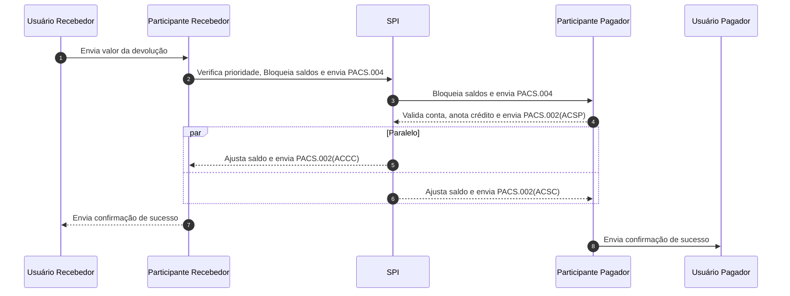

# Devolução de uma transação

Para gerar um reembolso deve-se necessariamente ter ocorrido um transação de sucesso. Uma 

## Regras

- **Duração:** O recebedor poderá realizar uma ou mais devoluções referentes a uma transação pelo período de 90 dias;
- **Valor:** O valor não poderá ultrapassar o valor total da transação;
- **Quantidade:** Sem limite de quantidade até o valor total ser transacionado. 
 

## Razões pela devolução

- **BE08** (BankError) - Devolução de pagamento iniciada pelo participante do usuário recebedor no âmbito do Mecanismo Especial de Devolução. Deve ser preenchido sempre que uma solicitação de devolução for iniciada pelo participante do usuário pagador com o motivo “falha operacional do PSP do pagador” ou sempre que a devolução for iniciada pelo participante do usuário recebedor por falha operacional em seus próprios sistemas.
- **FR01** (Fraud) - Devolução de pagamento, iniciada pelo participante do usuário recebedor no âmbito do - Mecanismo Especial de Devolução, motivada por fundada suspeita de fraude. Deve ser preenchido sempre que uma solicitação de devolução for iniciada pelo participante do usuário pagador com o motivo “fundada suspeita de fraude” ou sempre que a devolução for iniciada pelo participante do usuário recebedor por fundada suspeita de fraude.
- **MD06** (RefundRequestByEndCustomer) - Devolução de pagamento solicitado pelo usuário recebedor.
- **SL02** (SpecificServiceOfferedByCreditorAgent) - Devolução de pagamento solicitada pelo usuário recebedor - motivada por um erro relacionado ao Pix Saque ou ao Pix Troco.

## Etapas

- **Usuário Pagador->>Participante Pagador:** Envia dados completos do pagamento
- **Participante Pagador->>SPI:** Verifica prioridade, Bloqueia saldos e envia PACS.004
- **SPI->>Participante Recebedor:** Bloqueia saldos e envia PACS.004
- **Participante Recebedor-->>SPI:** Valida conta, anota crédito e envia PACS.002(ACSP)
- **Paralelo - SPI-->>Participante Recebedor:** Ajusta saldo e envia PACS.002(ACCC) 
- **Paralelo - SPI-->>Participante Pagador:** Ajusta saldo e envia PACS.002(ACSC)
- **Participante Pagador-->>Usuário Pagador:** Envia confirmação de sucesso
- **Participante Recebedor->>Usuário Recebedor:** Envia confirmação de sucesso

## Diagrama



## Mensagens trocadas

Mensagens com comentários de cada elemento do xml


### PACS.004 - DEVOLUÇÃO

```xml
<?xml version="1.0" encoding="UTF-8" standalone="no"?>
<Envelope xmlns="https://www.bcb.gov.br/pi/pacs.004/1.3">
  <AppHdr>
    <!-- Sempre o from vai ser a sua instituição -->
    <Fr>
      <FIId>
        <FinInstnId>
          <Othr>
            <Id>39664698</Id>
          </Othr>
        </FinInstnId>
      </FIId>
    </Fr>
    <!-- Sempre o to vai ser para o BACEN -->
    <To>
      <FIId>
        <FinInstnId>
          <Othr>
            <Id>00038166</Id>
          </Othr>
        </FinInstnId>
      </FIId>
    </To>
    <!-- ID da mensagem -->
    <BizMsgIdr>M0000000000000000000000000000000</BizMsgIdr>
    <MsgDefIdr>pacs.004.spi.1.3</MsgDefIdr>
    <!-- Data de criação da mensagem -->
    <CreDt>2020-01-01T08:30:12.000Z</CreDt>
    <Sgntr/>
  </AppHdr>
  <Document>
    <PmtRtr>
      <GrpHdr>
        <!-- ID da mensagem -->
        <MsgId>M0000000000000000000000000000000</MsgId>
        <!-- Data de criação da mensagem -->
        <CreDtTm>2020-01-01T08:30:12.000Z</CreDtTm>
        <!-- Quantidade de transações na mensagem podem ir de 1 a 10 -->
        <NbOfTxs>1</NbOfTxs>
        <SttlmInf>
          <!-- Sempre vai ser esse código que significa ClearingSystem -->
          <SttlmMtd>CLRG</SttlmMtd>
        </SttlmInf>
      </GrpHdr>
      <TxInf>
        <!-- ID devolução regras estão descritas no documento "Comunicação SPI" -->
        <RtrId>D9999901020200120123412345678901</RtrId>
        <!-- ID end to end vindo da PACS.008 -->
        <OrgnlEndToEndId>E9999901012341234123412345678900</OrgnlEndToEndId>
        <!-- Valor da devolução -->
        <RtrdIntrBkSttlmAmt Ccy="BRL">1000.00</RtrdIntrBkSttlmAmt>
        <!-- Prioridade da mensagem pode ser HIGH (envio normal do Pix) ou 
        NORM (Pix Agendado ou Suspeita de Fraude)  -->
        <SttlmPrty>HIGH</SttlmPrty>
        <!-- Sempre vai ser esse código que significa FollowingServiceLevel -->
        <ChrgBr>SLEV</ChrgBr>
        <!-- Razão pela qual foi realizada a devolução da transferência -->
        <RtrRsnInf>
          <Rsn>
            <Cd>BE08</Cd>
          </Rsn>
        </RtrRsnInf>
        <OrgnlTxRef>
          <DbtrAgt>
            <FinInstnId>
              <ClrSysMmbId>
                <!-- ISPB do participante recebedor. -->
                <MmbId>00000000</MmbId>
              </ClrSysMmbId>
            </FinInstnId>
          </DbtrAgt>
          <CdtrAgt>
            <FinInstnId>
              <ClrSysMmbId>
                <!-- ISPB do participante do pagador. -->
                <MmbId>00000000</MmbId>
              </ClrSysMmbId>
            </FinInstnId>
          </CdtrAgt>
        </OrgnlTxRef>
      </TxInf>
    </PmtRtr>
  </Document>
</Envelope>
```

### PACS.002 - Confirmação do PARTICIPANTE RECEBEDOR para SPI

```xml
<?xml version="1.0" encoding="UTF-8" standalone="no"?>
<Envelope xmlns="https://www.bcb.gov.br/pi/pacs.002/1.8">
  <AppHdr>
    <!-- Sempre o "from" vai ser a sua instituição -->
    <Fr>
      <FIId>
        <FinInstnId>
          <Othr>
            <Id>00000000</Id>
          </Othr>
        </FinInstnId>
      </FIId>
    </Fr>
    <!-- Sempre o to vai ser para o BACEN -->
    <To>
      <FIId>
        <FinInstnId>
          <Othr>
            <Id>00038166</Id>
          </Othr>
        </FinInstnId>
      </FIId>
    </To>
    <!-- ID da mensagem -->
    <BizMsgIdr>M0000000000000000000000000000000</BizMsgIdr>
    <MsgDefIdr>pacs.002.spi.1.8</MsgDefIdr>
    <!-- Data de criação da mensagem -->
    <CreDt>2020-01-01T08:30:12.000Z</CreDt>
    <Sgntr/>
  </AppHdr>
  <Document>
    <FIToFIPmtStsRpt>
      <GrpHdr>
        <!-- ID da mensagem -->
        <MsgId>M0000000000000000000000000000000</MsgId>
        <!-- Data de criação da mensagem -->
        <CreDtTm>2020-01-01T08:30:12.000Z</CreDtTm>
      </GrpHdr>
      <TxInfAndSts>
        <!-- O EndToEndId se for uma resposta para PACS.008 (liquidação) ou
        ReturnIdentification se for uma resposta para PACS.004 (devolução)  -->
        <OrgnlInstrId>E0000000000000000000000000000000</OrgnlInstrId>
        <!-- O EndToEndIdentification da PACS.008 (liquidação) -->
        <OrgnlEndToEndId>E0000000000000000000000000000000</OrgnlEndToEndId>
        <!-- ACSP - AcceptedSettlementInProcess - Prosseguimento de instrução de pagamento após as validação realizadas pelo participante do usuário recebedor. -->
        <TxSts>ACSP</TxSts>
      </TxInfAndSts>
    </FIToFIPmtStsRpt>
  </Document>
</Envelope>
```

### PACS.002 - Confirmação do SPI para PARTICIPANTE RECEBEDOR

```xml
<?xml version="1.0" encoding="UTF-8" standalone="no"?>
<Envelope xmlns="https://www.bcb.gov.br/pi/pacs.002/1.8">
  <AppHdr>
    <!-- Sempre o "from" vai ser a sua instituição -->
    <Fr>
      <FIId>
        <FinInstnId>
          <Othr>
            <Id>00000000</Id>
          </Othr>
        </FinInstnId>
      </FIId>
    </Fr>
    <!-- Sempre o to vai ser para o BACEN -->
    <To>
      <FIId>
        <FinInstnId>
          <Othr>
            <Id>00038166</Id>
          </Othr>
        </FinInstnId>
      </FIId>
    </To>
    <!-- ID da mensagem -->
    <BizMsgIdr>M0000000000000000000000000000000</BizMsgIdr>
    <MsgDefIdr>pacs.002.spi.1.8</MsgDefIdr>
    <!-- Data de criação da mensagem -->
    <CreDt>2020-01-01T08:30:12.000Z</CreDt>
    <Sgntr/>
  </AppHdr>
  <Document>
    <FIToFIPmtStsRpt>
      <GrpHdr>
        <!-- ID da mensagem -->
        <MsgId>M0000000000000000000000000000000</MsgId>
        <!-- Data de criação da mensagem -->
        <CreDtTm>2020-01-01T08:30:12.000Z</CreDtTm>
      </GrpHdr>
      <TxInfAndSts>
        <!-- O EndToEndId se for uma resposta para PACS.008 (liquidação) ou
        ReturnIdentification se for uma resposta para PACS.004 (devolução)  -->
        <OrgnlInstrId>E0000000000000000000000000000000</OrgnlInstrId>
        <!-- O EndToEndIdentification da PACS.008 (liquidação) -->
        <OrgnlEndToEndId>E0000000000000000000000000000000</OrgnlEndToEndId>
        <!-- ACCC - AcceptedSettlementCompleted - Notificação do SPI da conclusão da transação ao participante do usuário recebedor. -->
        <TxSts>ACCC</TxSts>
        <FctvIntrBkSttlmDt>
          <DtTm>2020-01-01T08:30:12.000Z</DtTm>
        </FctvIntrBkSttlmDt>
        <OrgnlTxRef>
            <IntrBkSttlmDt>2020-01-01</IntrBkSttlmDt>
        </OrgnlTxRef>
      </TxInfAndSts>
    </FIToFIPmtStsRpt>
  </Document>
</Envelope>
```

### PACS.002 - Confirmação do SPI para PARTICIPANTE PAGADOR

```xml
<?xml version="1.0" encoding="UTF-8" standalone="no"?>
<Envelope xmlns="https://www.bcb.gov.br/pi/pacs.002/1.8">
  <AppHdr>
    <!-- Sempre o "from" vai ser a sua instituição -->
    <Fr>
      <FIId>
        <FinInstnId>
          <Othr>
            <Id>00000000</Id>
          </Othr>
        </FinInstnId>
      </FIId>
    </Fr>
    <!-- Sempre o to vai ser para o BACEN -->
    <To>
      <FIId>
        <FinInstnId>
          <Othr>
            <Id>00038166</Id>
          </Othr>
        </FinInstnId>
      </FIId>
    </To>
    <!-- ID da mensagem -->
    <BizMsgIdr>M0000000000000000000000000000000</BizMsgIdr>
    <MsgDefIdr>pacs.002.spi.1.8</MsgDefIdr>
    <!-- Data de criação da mensagem -->
    <CreDt>2020-01-01T08:30:12.000Z</CreDt>
    <Sgntr/>
  </AppHdr>
  <Document>
    <FIToFIPmtStsRpt>
      <GrpHdr>
        <!-- ID da mensagem -->
        <MsgId>M0000000000000000000000000000000</MsgId>
        <!-- Data de criação da mensagem -->
        <CreDtTm>2020-01-01T08:30:12.000Z</CreDtTm>
      </GrpHdr>
      <TxInfAndSts>
        <!-- O EndToEndId se for uma resposta para PACS.008 (liquidação) ou
        ReturnIdentification se for uma resposta para PACS.004 (devolução)  -->
        <OrgnlInstrId>E0000000000000000000000000000000</OrgnlInstrId>
        <!-- O EndToEndIdentification da PACS.008 (liquidação) -->
        <OrgnlEndToEndId>E0000000000000000000000000000000</OrgnlEndToEndId>
        <!-- ACSC - AcceptedSettlementCompletedDebitorAccount - Notificação do SPI da conclusão da transação ao participante do usuário pagador.  -->
        <TxSts>ACSC</TxSts>
        <FctvIntrBkSttlmDt>
          <DtTm>2020-01-01T08:30:12.000Z</DtTm>
        </FctvIntrBkSttlmDt>
        <OrgnlTxRef>
            <IntrBkSttlmDt>2020-01-01</IntrBkSttlmDt>
        </OrgnlTxRef>
      </TxInfAndSts>
    </FIToFIPmtStsRpt>
  </Document>
</Envelope>
```