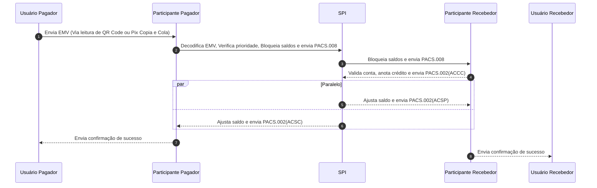

# Iniciação via QR Code Dinâmico (QRDN)

Para gerar um QR Code dinâmico é necessário vincular uma chave a esse QR Code. Exemplos de chaves abaixo:

- **email:** test@email.com
- **telefone:** +5511999999999
- **CPF/CNPJ:** 99999999999/99999999999999
- **Chave aleatória:** 33fb7bcd-8501-4f8f-afb4-a02a3d1b5bf2

## Etapas

- **Usuário Pagador->>Participante Pagador:** Envia EMV (Via leitura de QR Code ou Pix Copia e Cola)
- **Participante Pagador->>SPI:** Decodifica EMV, Verifica prioridade, Bloqueia saldos e envia PACS.008
- **SPI->>Participante Recebedor:** Bloqueia saldos e envia PACS.008
- **Participante Recebedor-->>SPI:** Valida conta, anota crédito e envia PACS.002(ACCC)
- **Paralelo - SPI-->>Participante Recebedor:** Ajusta saldo e envia PACS.002(ACSP) 
- **Paralelo - SPI-->>Participante Pagador:** Ajusta saldo e envia PACS.002(ACSC)
- **Participante Pagador-->>Usuário Pagador:** Envia confirmação de sucesso
- **Participante Recebedor->>Usuário Recebedor:** Envia confirmação de sucesso

## Diagrama



## Mensagens trocadas

Mensagens com comentários de cada elemento do xml


### PACS.008 - QRDN

```xml
<?xml version="1.0" standalone="no"?>
<Envelope xmlns="https://www.bcb.gov.br/pi/pacs.008/1.7">
  <AppHdr>
    <!-- Sempre o "from" vai ser a sua instituição -->
    <Fr>
      <FIId>
        <FinInstnId>
          <Othr>
            <Id>00000000</Id>
          </Othr>
        </FinInstnId>
      </FIId>
    </Fr>
    <!-- Sempre o "to" vai ser para o BACEN -->
    <To>
      <FIId>
        <FinInstnId>
          <Othr>
            <Id>00038166</Id>
          </Othr>
        </FinInstnId>
      </FIId>
    </To>
    <!-- ID da mensagem -->
    <BizMsgIdr>M0000000000000000000000000000000</BizMsgIdr>    
    <MsgDefIdr>pacs.008.spi.1.7</MsgDefIdr>
    <!-- Data de criação da mensagem -->
    <CreDt>2021-08-05T14:04:17.719Z</CreDt>
  </AppHdr>
  <Document>
    <FIToFICstmrCdtTrf>
      <GrpHdr>
        <!-- ID da mensagem -->
        <MsgId>M0000000000000000000000000000000</MsgId>   
        <!-- Data de criação da mensagem -->
        <CreDtTm>2019-07-26T16:00:00.510Z</CreDtTm>
        <!-- Quantidade de transações na mensagem podem ir de 1 a 10 -->
        <NbOfTxs>1</NbOfTxs>
        <SttlmInf>
          <!-- Sempre vai ser esse código que significa ClearingSystem -->
          <SttlmMtd>CLRG</SttlmMtd>
        </SttlmInf>
        <PmtTpInf>
          <!-- Prioridade da mensagem pode ser HIGH (envio normal do Pix) ou 
            NORM (Pix Agendado ou Suspeita de Fraude)  -->
          <InstrPrty>HIGH</InstrPrty>
          <SvcLvl>
            <!-- Tipo de pagamento PAGPRI(pagamento prioritário), 
            PAGFRD (pagamento com suspeita de fraude, condiciona a prop InstrPrty a NORM) 
            PAGAGD (pagamento agendado, condiciona a prop InstrPrty a NORM)  -->
            <Prtry>PAGPRI</Prtry>
          </SvcLvl>
        </PmtTpInf>
      </GrpHdr>
      <CdtTrfTxInf>
        <PmtId>
          <!-- ID end to end regras estão descritas no documento "Comunicação SPI"
             esse id será utilizado para fazer o match entre diferentes mensagens -->
          <EndToEndId>E00000000000000000000000000</EndToEndId>
        </PmtId>
        <!-- Valor da transação atributo BRL obrigatório é o valor total da transação -->
        <IntrBkSttlmAmt Ccy="BRL">666.88</IntrBkSttlmAmt>
        <!-- Data de criação da transação -->
        <AccptncDtTm>2019-07-26T15:59:57.800Z</AccptncDtTm>
        <!-- Sempre vai ser esse código que significa FollowingServiceLevel -->
        <ChrgBr>SLEV</ChrgBr>
        <MndtRltdInf>
          <Tp>
            <LclInstrm>
              <!-- TIPO de iniciação MANU (manual inserindo dados ag/cc taxId etc) 
              DICT (usando chaves, condiciona a prop Proxy a obrigatoriedade), 
              INIC (por iniciador de pagamentos, já possui informações do recebedor, condiciona a prop Proxy a obrigatoriedade) 
              QRDN (usando QR Code dinâmico, condiciona a prop Proxy a obrigatoriedade) e 
              QRES (usando QR Code estático, condiciona a prop Proxy a obrigatoriedade) -->
              <Prtry>QRDN</Prtry>
            </LclInstrm>
          </Tp>
        </MndtRltdInf>
        <!-- Informações do usuário pagador -->
        <Dbtr>
          <!-- Nome -->
          <Nm>Fulano da Silva</Nm>
          <Id>
            <PrvtId>
              <Othr>
                <!-- CPF ou CNPJ -->
                <Id>00000000000</Id>
              </Othr>
            </PrvtId>
          </Id>
        </Dbtr>
        <DbtrAcct>
          <Id>
            <Othr>
              <!-- Conta, se houver valor alfanumérico, este deve ser convertido para 0 -->
              <Id>000000000</Id>
              <!-- Agencia, não obrigatório -->
              <Issr>0000</Issr>
            </Othr>
          </Id>
          <Tp>
            <!-- Tipo de conta podendo ser: CACC(corrente), SLRY(salário, ainda não é utilizado), 
            SVGS(poupança) e TRAN (conta pagamento) -->
            <Cd>CACC</Cd>
          </Tp>
        </DbtrAcct>
        <DbtrAgt>
          <FinInstnId>
            <ClrSysMmbId>
              <!-- ISPB do participante pagador -->
              <MmbId>00000000</MmbId>
            </ClrSysMmbId>
          </FinInstnId>
        </DbtrAgt>
        <!-- Informações do usuário recebedor -->
        <CdtrAgt>
          <FinInstnId>
            <ClrSysMmbId>
              <!-- ISPB do participante recebedor -->
              <MmbId>00000000</MmbId>
            </ClrSysMmbId>
          </FinInstnId>
        </CdtrAgt>
        <Cdtr>
          <Id>
            <PrvtId>
              <Othr>
                <!-- CPF ou CNPJ -->
                <Id>00000000000</Id>
              </Othr>
            </PrvtId>
          </Id>
        </Cdtr>
        <CdtrAcct>
          <Id>
            <Othr>
              <!-- Conta, se houver valor alfanumérico, este deve ser convertido para 0 -->
              <Id>000000000000</Id>
              <!-- Agencia, não obrigatório -->
              <Issr>0000</Issr>
            </Othr>
          </Id>
          <Tp>
            <!-- Tipo de conta podendo ser: CACC(corrente), SLRY(salário, ainda não é utilizado), 
            SVGS(poupança) e TRAN (conta pagamento) -->
            <Cd>CACC</Cd>
          </Tp>
          <Prxy>
            <Id>email0@exemplo.com.br</Id>
          </Prxy>
        </CdtrAcct>
        <Purp>
          <!-- IPAY (pagamento instantâneos), GSCB (pix troco), OTHR(pix saque) -->
          <Cd>IPAY</Cd>
        </Purp>
        <RmtInf>
          <!-- Campo onde o usuário pagador escreve uma mensagem para o recebedor 140char -->
          <Ustrd>mensagem opcional</Ustrd>
        </RmtInf>
      </CdtTrfTxInf>
    </FIToFICstmrCdtTrf>
  </Document>
</Envelope>
```

### PACS.002 - Confirmação do PARTICIPANTE RECEBEDOR para SPI

```xml
<?xml version="1.0" encoding="UTF-8" standalone="no"?>
<Envelope xmlns="https://www.bcb.gov.br/pi/pacs.002/1.8">
  <AppHdr>
    <!-- Sempre o "from" vai ser a sua instituição -->
    <Fr>
      <FIId>
        <FinInstnId>
          <Othr>
            <Id>00000000</Id>
          </Othr>
        </FinInstnId>
      </FIId>
    </Fr>
    <!-- Sempre o to vai ser para o BACEN -->
    <To>
      <FIId>
        <FinInstnId>
          <Othr>
            <Id>00038166</Id>
          </Othr>
        </FinInstnId>
      </FIId>
    </To>
    <!-- ID da mensagem -->
    <BizMsgIdr>M0000000000000000000000000000000</BizMsgIdr>
    <MsgDefIdr>pacs.002.spi.1.8</MsgDefIdr>
    <!-- Data de criação da mensagem -->
    <CreDt>2020-01-01T08:30:12.000Z</CreDt>
    <Sgntr/>
  </AppHdr>
  <Document>
    <FIToFIPmtStsRpt>
      <GrpHdr>
        <!-- ID da mensagem -->
        <MsgId>M0000000000000000000000000000000</MsgId>
        <!-- Data de criação da mensagem -->
        <CreDtTm>2020-01-01T08:30:12.000Z</CreDtTm>
      </GrpHdr>
      <TxInfAndSts>
        <!-- O EndToEndId se for uma resposta para PACS.008 (liquidação) ou
        ReturnIdentification se for uma resposta para PACS.004 (devolução)  -->
        <OrgnlInstrId>E0000000000000000000000000000000</OrgnlInstrId>
        <!-- O EndToEndIdentification da PACS.008 (liquidação) -->
        <OrgnlEndToEndId>E0000000000000000000000000000000</OrgnlEndToEndId>
        <!-- ACSP - AcceptedSettlementInProcess - Prosseguimento de instrução de pagamento após as validação realizadas pelo participante do usuário recebedor. -->
        <TxSts>ACSP</TxSts>
      </TxInfAndSts>
    </FIToFIPmtStsRpt>
  </Document>
</Envelope>
```

### PACS.002 - Confirmação do SPI para PARTICIPANTE RECEBEDOR

```xml
<?xml version="1.0" encoding="UTF-8" standalone="no"?>
<Envelope xmlns="https://www.bcb.gov.br/pi/pacs.002/1.8">
  <AppHdr>
    <!-- Sempre o "from" vai ser a sua instituição -->
    <Fr>
      <FIId>
        <FinInstnId>
          <Othr>
            <Id>00000000</Id>
          </Othr>
        </FinInstnId>
      </FIId>
    </Fr>
    <!-- Sempre o to vai ser para o BACEN -->
    <To>
      <FIId>
        <FinInstnId>
          <Othr>
            <Id>00038166</Id>
          </Othr>
        </FinInstnId>
      </FIId>
    </To>
    <!-- ID da mensagem -->
    <BizMsgIdr>M0000000000000000000000000000000</BizMsgIdr>
    <MsgDefIdr>pacs.002.spi.1.8</MsgDefIdr>
    <!-- Data de criação da mensagem -->
    <CreDt>2020-01-01T08:30:12.000Z</CreDt>
    <Sgntr/>
  </AppHdr>
  <Document>
    <FIToFIPmtStsRpt>
      <GrpHdr>
        <!-- ID da mensagem -->
        <MsgId>M0000000000000000000000000000000</MsgId>
        <!-- Data de criação da mensagem -->
        <CreDtTm>2020-01-01T08:30:12.000Z</CreDtTm>
      </GrpHdr>
      <TxInfAndSts>
        <!-- O EndToEndId se for uma resposta para PACS.008 (liquidação) ou
        ReturnIdentification se for uma resposta para PACS.004 (devolução)  -->
        <OrgnlInstrId>E0000000000000000000000000000000</OrgnlInstrId>
        <!-- O EndToEndIdentification da PACS.008 (liquidação) -->
        <OrgnlEndToEndId>E0000000000000000000000000000000</OrgnlEndToEndId>
        <!-- ACCC - AcceptedSettlementCompleted - Notificação do SPI da conclusão da transação ao participante do usuário recebedor. -->
        <TxSts>ACCC</TxSts>
        <FctvIntrBkSttlmDt>
          <DtTm>2020-01-01T08:30:12.000Z</DtTm>
        </FctvIntrBkSttlmDt>
        <OrgnlTxRef>
            <IntrBkSttlmDt>2020-01-01</IntrBkSttlmDt>
        </OrgnlTxRef>
      </TxInfAndSts>
    </FIToFIPmtStsRpt>
  </Document>
</Envelope>
```

### PACS.002 - Confirmação do SPI para PARTICIPANTE PAGADOR

```xml
<?xml version="1.0" encoding="UTF-8" standalone="no"?>
<Envelope xmlns="https://www.bcb.gov.br/pi/pacs.002/1.8">
  <AppHdr>
    <!-- Sempre o "from" vai ser a sua instituição -->
    <Fr>
      <FIId>
        <FinInstnId>
          <Othr>
            <Id>00000000</Id>
          </Othr>
        </FinInstnId>
      </FIId>
    </Fr>
    <!-- Sempre o to vai ser para o BACEN -->
    <To>
      <FIId>
        <FinInstnId>
          <Othr>
            <Id>00038166</Id>
          </Othr>
        </FinInstnId>
      </FIId>
    </To>
    <!-- ID da mensagem -->
    <BizMsgIdr>M0000000000000000000000000000000</BizMsgIdr>
    <MsgDefIdr>pacs.002.spi.1.8</MsgDefIdr>
    <!-- Data de criação da mensagem -->
    <CreDt>2020-01-01T08:30:12.000Z</CreDt>
    <Sgntr/>
  </AppHdr>
  <Document>
    <FIToFIPmtStsRpt>
      <GrpHdr>
        <!-- ID da mensagem -->
        <MsgId>M0000000000000000000000000000000</MsgId>
        <!-- Data de criação da mensagem -->
        <CreDtTm>2020-01-01T08:30:12.000Z</CreDtTm>
      </GrpHdr>
      <TxInfAndSts>
        <!-- O EndToEndId se for uma resposta para PACS.008 (liquidação) ou
        ReturnIdentification se for uma resposta para PACS.004 (devolução)  -->
        <OrgnlInstrId>E0000000000000000000000000000000</OrgnlInstrId>
        <!-- O EndToEndIdentification da PACS.008 (liquidação) -->
        <OrgnlEndToEndId>E0000000000000000000000000000000</OrgnlEndToEndId>
        <!-- ACSC - AcceptedSettlementCompletedDebitorAccount - Notificação do SPI da conclusão da transação ao participante do usuário pagador.  -->
        <TxSts>ACSC</TxSts>
        <FctvIntrBkSttlmDt>
          <DtTm>2020-01-01T08:30:12.000Z</DtTm>
        </FctvIntrBkSttlmDt>
        <OrgnlTxRef>
            <IntrBkSttlmDt>2020-01-01</IntrBkSttlmDt>
        </OrgnlTxRef>
      </TxInfAndSts>
    </FIToFIPmtStsRpt>
  </Document>
</Envelope>
```